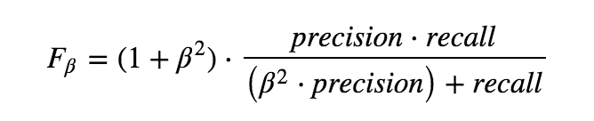
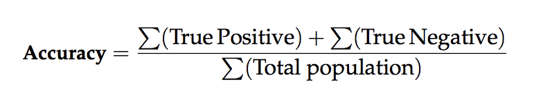
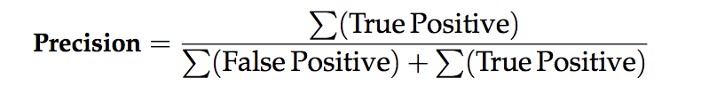
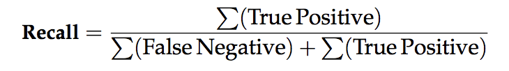
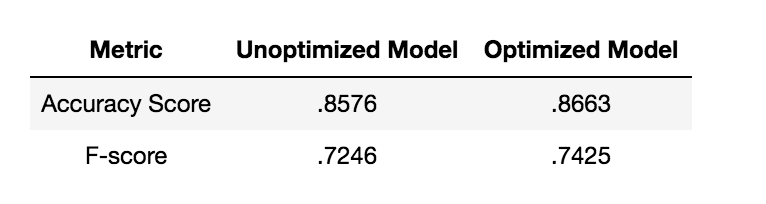

# Machine Learning Engineer Nanodegree
## Capstone Proposal
Mark Black  
12/11/17

## Is the Price of Bitcoin Predictable using a Combination of Volume, Volatility or the Bid/Ask Spread? ## 

### Domain Background

***What is a Bitcoin?***
 
Bitcoin is a cryptocurrency that was designed as a digital payments processing system that relies on crytography in order to secure transactions. There is much mythology built around Bitcoin's creation and it's creator Satoshi Nakamoto who in late 2008 authored the white paper "Bitcoin: A Peer-to-Peer Electronic Cash System"(1). Bitcoin's technological revolution is it's blockchain technology where all transactions including the creation of new bitcoins are stored and verified. Since 2008 countless cryptocurrencies known as [Altcoins](http://www.businessinsider.com/list-top-cryptocurrencies-analysis-comparison-2017-10) have emerged in the space such as Ethereum and Litecoin. Over the past couple of year Bitcoin has skyrocketed from obscurity into mainstream as it's price continues it's meteoric rise with many calling this rapid ascension a "bubble". Recently the CBOE and CME offered Bitcoin futures for trading signally the cryptocurrecncy's legitimacy as an tradeable asset. 

Is Bitcoin a "bubble"(4)? Is it here to stay? Will global Central Banks and governments wipe out Bitcoin holders? These are the central questions that plague crytocurrencies today in their nascent stage. These questions are central for investors and potential investors who are trying to assess the long-term structural risks inherent in new asset classes. 

There has been a lot of research dedicated to deciphering Bitcoin's price and trying to predict it's future value. Some interesting work has been done in trying to use sentiment analysis from social media as a predictive feature(2). Other studies have been devoted towards looking at possible tells in the technical indicators like volume or change in volume as a forecasting mechanism(3). Some research has attempted to dissect the historical context surrounding Bitcoin's rise from the underlying motivations of different "agents" (i.e. traders and non-traders) to the different financial market regimes since 2009(3). The motivation behind this proposal is a simplified version of this research paper(5) that tests whether machine learning algorithm given 16 key Bitcoin indicators can be used to predict the future price of Bitcoin.

### Problem Statement

Much of finance and trading is motivated by the crusade to find the next money machine and at the moment much of finance is focused on trying to understand and therefore predict the general direction of Bitcoin's price. This proposal is concerned with the questions:
  
***Can we use Machine Learning Classification Models to aid us in understanding and possibly forecasting the price of Bitcoin using Volume, Volatility, Bid/Ask Spread, or a combination?*** 

While it may be tempting to create a simple trading simulator this proposal will not attempt to delve into the viability of using Machine Learning models in terms of a trading environment. The primary focus of the report is to only will be to explore a few underlying potential factors that govern Bitcoin's price movements. The input features we will be looking at are daily: Trading Volume, Volatility, Bid/Ask Spread ratio, Hashrate, Mining Difficulty, Market Cap, Block Size, Time Between Blocks and Number of Transactions. 

These input features will be used to train Machine Learning models that attempt to predict whether tomorrow's price will be higher "up" or "down" lower than the previous day's closing price. The best model for predicting a binary outcome is a classification algorithm and there are wide variety of different machine learning models at our disposal.
 
### Datasets and Inputs

Data for this project will be pulled from various data API sources. The primary source will be Quandl which offers mostly free economic and financial datasets, the St. Lious Federal Research database (FRED) and a few miscellaneous data sets pulled from a variety of sources. The period or timeframe that will be used is daily.

**Datasets**
 
***Quandl:***
 
[Bitcoin daily price bitstampUSD](https://www.quandl.com/data/BCHARTS/BITSTAMPUSD-Bitcoin-Markets-bitstampUSD) 

***Bitcoin***
 
[Bitcoin Data:](https://data.bitcoinity.org)

Breakdown of the selected features:

Feature | Continuous or Categorial | Description
--- | --- | ---
Trading Volume | Continuous | Total Daily volume in USD from all exchanges
Volaility | Continuous | Volatility is calculated as standard deviation from all market trades
Bid/Ask Spread | Continuous | Average daily spread between the Bid and Ask
Hashrate | Continuous | Average daily speed at which a computer is completing an operation in the Bitcoin code
Mining Difficulty | Continuous | How difficult it is to find a new block
Market Cap | Continuous | End of day total number of bitcoins times market value
Block Size | Continuous | Average block size (MB)
Time Between Blocks | Continuous | Average time to mine a block in minutes
Number of Transactions | Continuous |  Total number of unique Bitcoin transactions per day

***Dataset Decomposition***
 

- The data will be broken into Training Set/Testing Set: 80%/20%
- The proposed date range will be between 01/01/2013-12/01/2017. These dates were mostly determined by the availability of data available.
- The total number of data points will be 1796
- The number of positive days ("up") is 1009 and the number of negative days ("down") is 787

### Solution Statement

In order to solve the problem(s) proposed above various macro economic variables must be tested to determine if any exhibit some colinearity with the price of Bitcoin. This proposal will focus on fundamental asset data that are intuitively correlated to the price of bitcoin like other alternative stores of money (i.e. gold) to currencies (i.e. USD) to monetary indicators like "total assets" owned by the individual Central Banks of the developed world and the collective "total assets" by all 3. Once all the data has been properly vetted and prepared the separation of training and testing sets takes place. Then each model is trained, tested and evaluated according to their f-beta score.

### Benchmark Model
_(approximately 1-2 paragraphs)_

Following the coin flip bar models will be ranked according to their the evaluation criteria outlined below.

### Evaluation Metrics

***F-beta Score***

***Precision, Recall, Accuracy***
 
 
**Accuracy** measures how often the classifier makes the correct prediction. It’s the ratio of the number of correct predictions to the total number of predictions (the number of test data points).
 
 

**Precision** tells us what proportion of forecasts we classified as up, actually were up.
It is a ratio of true positives(words classified as up, and which are actually up) to all positives(all words classified as up, irrespective of whether that was the correct classification), in other words it is the ratio of

 

**Recall(sensitivity)** tells us what proportion of forecasts that actually were up were classified by us as up.
It is a ratio of true positives(words classified as up, and which are actually up) to all the words that were actually up, in other words it is the ratio of

 

### Project Design

***Data Preparation***
 
The first step is to import all the data from their respective API's or loaded locally. After all the data has been imported and collected some data exploratory analysis will be performed to detect any data that needs to be cleaned (i.e. NA's missing data) or if any variables need to be noramlized and convert any non-numeric variables into categorial dummy variables through the one-hot encoding process. The dependent variable (output) is then separated from the independent variables (input) variables. Once separated the dependent variable will need to be converted into a binary outcome (1 for "up" and 0 for "down").

***Model Selections and Implementation***
  
Luckily there are a nice selection of Supervised Learning models at our disposable and we will select at least 3 different models from the list below:

- Gaussian Naive Bayes (GaussianNB)
- Decision Trees
- Ensemble Methods (Bagging, AdaBoost, Random Forest, Gradient Boosting)
- K-Nearest Neighbors (KNeighbors)
- Stochastic Gradient Descent Classifier (SGDC)
- Support Vector Machines (SVM)
- Logistic Regression

***Model Implentation***
 
During the model implementation phase the data is broken up with 80% training and 20% test set. The chosen models learn from the training set and tests it's predictions on the testing set.

- Import `fbeta_score` and `accuracy_score` from [`sklearn.metrics`](http://scikit-learn.org/stable/modules/classes.html#sklearn-metrics-metrics).
 - Fit the learner to the sampled training data and record the training time.
 - Perform predictions on the test data `X_test`, and also on the first 300 training points `X_train[:300]`.
 - Calculate the accuracy score for both the training subset and testing set.
 - Calculate the F-score for both the training subset and testing set.

***Model Evaluation***
 
And the winner is... here each model's f-beta score will be calculated and compared against the other models in order to ascertain which model performed the best.

***Tuning and Improving the Model***
 
In an effort to fine tune the parameters of the winning model grid search (GridSearchCV) will be employed. Using a parameter optimizer like scikitlearn's GridSearchCV will facilitate a better understanding of how the features affect or influence the decision boundary produced by the model. 

***Final Model Performance***
 

Now that the final results have been tabulated a final performance summary report will summarize the key metrics of the best performing model and offer areas of improvement.

In addition some of the key features with the most predictive power will be explored in order to better understand their relationship wtih the target label. During this distillation process each selected features relevance will be assessed. Once the most significant features have been identified the winning model will be trained on this smaller feature subspace. This will simplify the model without hopefully compromising performance. After the smaller features subspace has been evaluated a comparison of the full set of features against the small subset of key features will be made.

---
References:
 
(1)[Wikipedia for Bitcoin](https://en.wikipedia.org/wiki/History_of_bitcoin)
 
(2)["Predicting Bitcoin price fluctuation with Twitter sentiment analysis"](http://www.diva-portal.org/smash/get/diva2:1110776/FULLTEXT01.pdf)
 
(2)[Can Volume Predict Bitcoin Returns and Volatility? A Quantiles-Based Approach](https://poseidon01.ssrn.com/delivery.php?ID=679064026081103078116107114017112078003010031014027056097107102011066114109071073068007100042121052122038095104004097122101106028042064064059127076021101095097005004018008075068009089064023108021085084125066117065107113028094007064026125117127091004094&EXT=pdf)
 
(3)[A modelling of bitcoin price dynamics by the artificial market algorithm](https://poseidon01.ssrn.com/delivery.php?ID=313027093103007071100088092106067095029078064077029082029098017075114103102016007103006022018042109022044118085029086106029109006076043087080124006114023119080006099010045062064030088081120019123068119006126071121099016113101080115098096088006126003031&EXT=pdf)
 
(4)[It's Official: Bitcoin Surpasses "Tulip Mania", Is Now The Biggest Bubble In World History](http://www.zerohedge.com/news/2017-12-12/its-official-bitcoin-surpasses-tulip-mania-now-biggest-bubble-world-history)
 
(5[Automated Bitcoin Trading via Machine Learning Algorithms](http://cs229.stanford.edu/proj2014/Isaac%20Madan,%20Shaurya%20Saluja,%20Aojia%20Zhao,Automated%20Bitcoin%20Trading%20via%20Machine%20Learning%20Algorithms.pdf)
 
