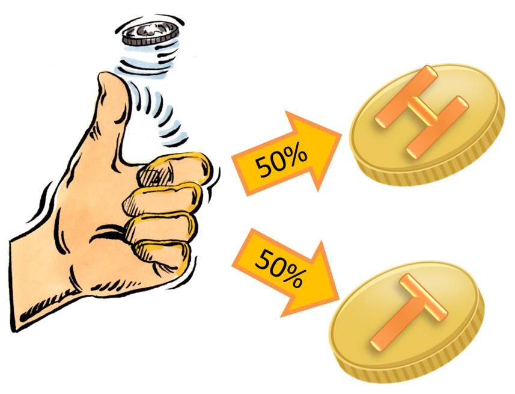

# Machine Learning Engineer Nanodegree
## Capstone Proposal
Mark Black  
12/11/17

## Is Bitcoin Price Predictable? ## 

### Domain Background
references: https://en.wikipedia.org/wiki/History_of_bitcoin

***What is a Bitcoin?***
Bitcoin is a cryptocurrency that was designed as a digital payments processing system that relies on crytography in order to secure transactions. There is much mythology built around Bitcoin's creation and it's creator Satoshi Nakamoto who in late 2008 authored the white paper "Bitcoin: A Peer-to-Peer Electronic Cash System". Bitcoin's technological revolution is it's blockchain technology where all transactions including the creation of new bitcoins are stored and verified. Since 2008 countless cryptocurrencies known as [Altcoins](http://www.businessinsider.com/list-top-cryptocurrencies-analysis-comparison-2017-10) have emerged in the space such as Ethereum and Litecoin. Over the past couple of year Bitcoin has skyrocketed from obscurity into mainstream as it's price continues it's meteoric rise with many calling this rapid ascension a "bubble". Recently the CBOE and CME offered Bitcoin futures for trading signally the cryptocurrecncy's legitimacy as an tradeable asset. 

Is Bitcoin a "bubble"? Is it here to stay? Will global Central Banks and governments wipe out Bitcoin holders? These are the central questions that plague crytocurrencies today in their nascent stage. These questions are central for investors and potential investors who are trying to assess the long-term structural risks inherent in new asset classes. 
 
Misc Ideas:
Silk Road

### Problem Statement

Much of finance and trading in particular is motivated by the crusade to find the next money machine and trading is no exception. So from a trading standpoint the above questions are not as interesting as trying to determine whether shorter-term opportunities exist in the price movements of assets. This proposal is concerned with the questions:
  
***Is the price of Bitcoin predictable using a single or multiple factor model?*** 
  
***Can we use Machine Learning techniques to aid us in understanding and possibly forecasting the price of cryptocurrencies*** 

In financial markets trying to understand and predict the price of assets is the name of the game and the introduction of a volatile instrument like Bitcoin presents opportunity as well as excitement for traders. The report will explore the underlying potential factors that govern Bitcoin's price movements. Once we have identified the factors that exert the most influence we will try to train Machine Learning models that attempt to predict whether the tomorrow's price will be higher "up" or "down" lower than the previous day's closing price. In order to determine whether our model adds any informtional value we will compare our results against the  "coin flip test" with a benchmark of 50% or simply guessing.

### Datasets and Inputs

Data for this project will be pulled from various data API sources. The primary source will be Quandl which offers mostly free economic and financial datasets, the St. Lious Federal Research database (FRED) and a few miscellaneous data sets pulled from a variety of sources.

**Datasets**
 
***Quandl:***
 
[Bitcoin daily price bitstampUSD](https://www.quandl.com/data/BCHARTS/BITSTAMPUSD-Bitcoin-Markets-bitstampUSD) 
 
[Gold Futures](https://www.quandl.com/data/CHRIS/CME_GC1-Gold-Futures-Continuous-Contract-1-GC1-Front-Month)
[M2 Money Supply (USD)](https://www.quandl.com/data/FRED/M2-M2-Money-Stock)
[Dollar Index](https://www.quandl.com/data/CHRIS/ICE_DX1-US-Dollar-Index-Futures-Continuous-Contract-1-DX1-Front-Month)

***St. Lious Fed (FRED)***
 
[Federal Reserve: Total Assets](https://fred.stlouisfed.org/series/WALCL)
 
[Bank of Japan: Total Assets](https://fred.stlouisfed.org/series/JPNASSETS)
 
[European Central Bank: Total Assets](https://fred.stlouisfed.org/series/ECBASSETS)
 

***Potential Additional Variables***
 
[Bitcoin trading volume breakdown:](http://data.bitcoinity.org/markets/volume/all?c=e&t=b)

Exchange Rates/Currency Cross Pairs
 

### Solution Statement

In order to solve the problem(s) proposed above we must test various macro economic variables that may exhibit some colinearity with the price of Bitcoin. We will first look at assets or variables that would intuitively be correlated to the price of bitcoin like other alternative stores of money (i.e. gold) to currencies (i.e. USD) to monetary indicators like "total assets" owned by the individual Central Banks of the developed world and the collective "total assets" by all 3. Once we have settled on a set of independent variables we can then train various models and test our model(s) on cross validated datasets. At the end of the day our model will be evaluated on their f-beta score.

### Benchmark Model
_(approximately 1-2 paragraphs)_

As mentioned above our baseline benchmark will be a 50/50 coin flip. We will build from there by testing various Supervised Learning models (listed in the Project Design) in order to discover which model or models perform best on the test set.  

### Evaluation Metrics

***F-beta Score***

***Precision, Recall, Accuracy***
 
 
**Accuracy** measures how often the classifier makes the correct prediction. It’s the ratio of the number of correct predictions to the total number of predictions (the number of test data points).
 
 

**Precision** tells us what proportion of forecasts we classified as up, actually were up.
It is a ratio of true positives(words classified as up, and which are actually up) to all positives(all words classified as up, irrespective of whether that was the correct classification), in other words it is the ratio of

 

**Recall(sensitivity)** tells us what proportion of forecasts that actually were up were classified by us as up.
It is a ratio of true positives(words classified as up, and which are actually up) to all the words that were actually up, in other words it is the ratio of

 

For classification problems that are skewed in their classification distributions like in our case, for example if we had a 100 text messages and only 2 were spam and the rest 98 weren't, accuracy by itself is not a very good metric. We could classify 90 messages as not spam(including the 2 that were spam but we classify them as not spam, hence they would be false negatives) and 10 as spam(all 10 false positives) and still get a reasonably good accuracy score. For such cases, precision and recall come in very handy. These two metrics can be combined to get the F1 score, which is weighted average(harmonic mean) of the precision and recall scores. This score can range from 0 to 1, with 1 being the best possible F1 score(we take the harmonic mean as we are dealing with ratios).

### Project Design

***Data Preparation***
 
The first step is to import all the data from their respective API's or loaded locally. After all the data has been imported and collected some data exploratory analysis will be performed to detect any data that needs to be cleaned (i.e. NA's missing data) or if any variables need to be noramlized and convert any non-numeric variables into categorial dummy variables through the one-hot encoding process. The dependent variable (output) is then separated from the independent variables (input) variables. Once separated the dependent variable will need to be converted into a binary outcome (1 for "up" and 0 for "down").

***Model Selections and Implementation***
  
Luckily there are a nice selection of Supervised Learning models at our disposable and we will select at least 3 different models from the list below:

- Gaussian Naive Bayes (GaussianNB)
- Decision Trees
- Ensemble Methods (Bagging, AdaBoost, Random Forest, Gradient Boosting)
- K-Nearest Neighbors (KNeighbors)
- Stochastic Gradient Descent Classifier (SGDC)
- Support Vector Machines (SVM)
- Logistic Regression

***Model Implentation***
 
During the model implementation phase the data is broken up into a training and a test set. The chosen models learn from the training set and tests it's predictions on the testing set.

- Import `fbeta_score` and `accuracy_score` from [`sklearn.metrics`](http://scikit-learn.org/stable/modules/classes.html#sklearn-metrics-metrics).
 - Fit the learner to the sampled training data and record the training time.
 - Perform predictions on the test data `X_test`, and also on the first 300 training points `X_train[:300]`.
 - Calculate the accuracy score for both the training subset and testing set.
 - Calculate the F-score for both the training subset and testing set.

***Model Evaluation***
 
And the winner is... here each model's f-beta score will be calculated and compared against the other models in order to ascertain which model performed the best.

***Tuning and Improving the Model***
 
In an effort to fine tune the parameters of the winning model grid search (GridSearchCV) will be employed. Using a parameter optimizer like scikitlearn's GridSearchCV will facilitate a better understanding of how the features affect or influence the decision boundary produced by the model. 

***Final Model Performance***
 

Now that the final results have been tabulated a final performance summary report will summarize the key metrics of the best performing model and offer areas of improvement.

In addition some of the key features with the most predictive power will be explored in order to better understand their relationship wtih the target label. During this distillation process each selected features relevance will be assessed. Once the most significant features have been identified the winning model will be trained on this smaller feature subspace. This will simplify the model without hopefully compromising performance. After the smaller features subspace has been evaluated a comparison of the full set of features against the small subset of key features will be made.

-----------

**Before submitting your proposal, ask yourself. . .**

- Does the proposal you have written follow a well-organized structure similar to that of the project template?
- Is each section (particularly **Solution Statement** and **Project Design**) written in a clear, concise and specific fashion? Are there any ambiguous terms or phrases that need clarification?
- Would the intended audience of your project be able to understand your proposal?
- Have you properly proofread your proposal to assure there are minimal grammatical and spelling mistakes?
- Are all the resources used for this project correctly cited and referenced?
