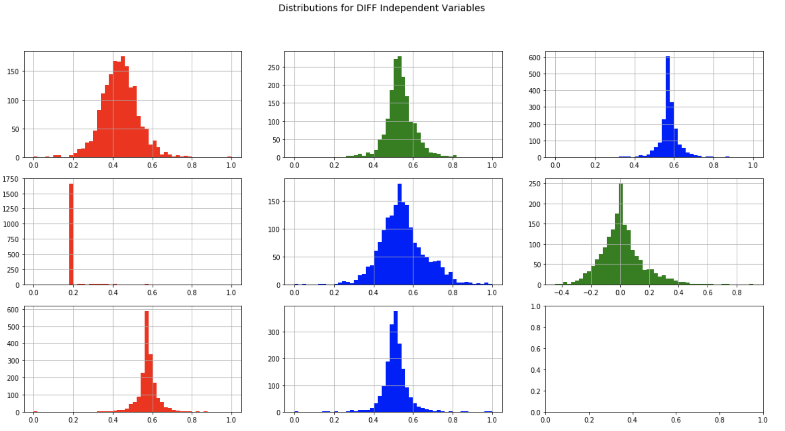
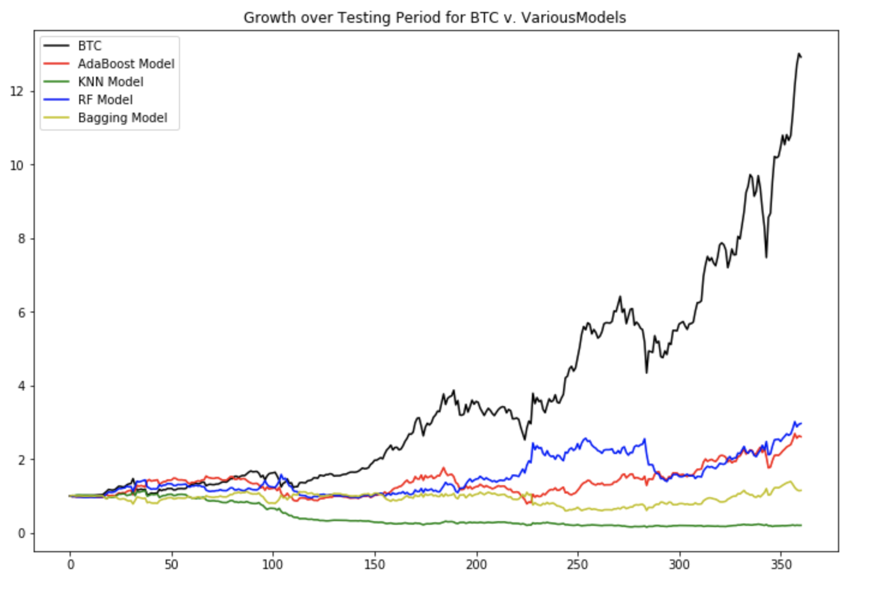
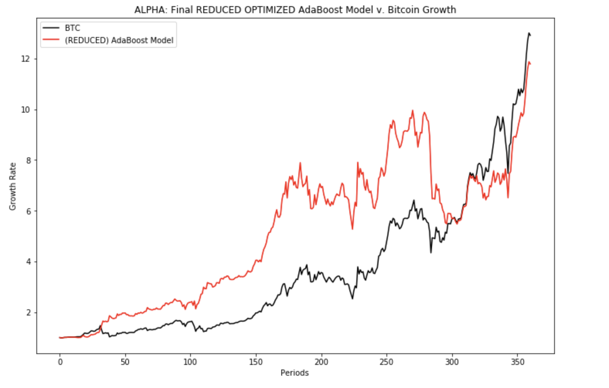

# Machine Learning Engineer Nanodegree
### Capstone Project
#### Predicting the Price of Bitcoin
Mark Black
<br>
December 19th, 2017
___

## I. Definition

### Project Overview
The field of finance is typically a stodgy tried and true industry where innovation is more evolutionary  than revolutionary. In the past few years the rapid rise in cryptocurrencies has ushered in a whole new digital financial ecosystem. Crytocurrencies have the potential to disrupt areas from payment processing to how we think about physical versus virtual assets. Bitcoin mania has swept the world as the price of the cryptocurrency continues to skyrocket. 

Finance professionals particularly those working on Wall Street have typically relied heavily on Excel spreadsheets, Econometrics and linear regression models for analysis. The rise of Machine Learning somewhat parallels the ascent of cryptocurriences as the businesses rapidly adopt and adjust to the era of "Big Data". This project explores the potential that Supervised Machine Learning in trying to predict the future price of Bitcoin.  

Even though it is still early innings there is already a ton of work being focused on trying to understand and predict the price of cryptoassets. Much of this project draws inspiration from the work Madan, ***et al***, where Supervised Machine Learning was used to forecast the price of Bitcoin but on shorter intraday time frames<sup>1</sup> 

This project deals with Bitcoin data on a daily time frame. Although it would have been nice and perhaps even more fruitful to use shorter time frame intervals unfortunately the availability of data for all variables played was the deciding factor. The datasets for all independent features can be found at [Blockchain.info](https://blockchain.info/) in the form of downloadable csv files. An alternative source to find the data is at [Quandl Blockchain](https://www.quandl.com/data/BCHAIN-Blockchain?keyword=)<sup>2</sup>.

### Problem Statement
Trying to predict the future price of any security or asset is central to Wall Street's ability to generate profitable trading and investment strategies. Bitcoin may have been originally intended to function as a digital payment processing system but participants have primarily been focused on it's speculative store of value. In the last year many crytocurrencies have risen more than tenfold in less than a year. Now with both the CBOE and CME introducing Bitcoin futures the motivation to forecast Bitcoin's daily price movements is a potentially lucrative endeavor<sup>3</sup>.

This project will employ a wide variety of Classification algorithms in order predict if Bitcon's price will the "up" or "down" each day in the test set. The data will be separated into sequential training and testing sets with each model being trained on the former and tested on the latter. 

From there the accuracy and f-scores for each individual model will be assessed along with it's performance as an automated trading system. Testing the profitability metrics of a trading system is known as "backtesting". At the end of the day the viability for any trading strategy is it's profiability above and beyond a buy and hold benchmark strategy (usually the annual return of the S&P500 index).

The following classifiers were selected:

- AdaBoost (Ensemble)
- Random Forest (Ensemble)
- Bagging (Ensemble)
- K-Nearest Neighbors (KNeighbors)
- Support Vector Machines (SVM)
- Logistic Regression

### Metrics
The preliminary metrics that the models will be judged against are precision, accuracy, recall and f-scores detailed below:

***F-beta Score***


***Precision, Recall, Accuracy***
<br>
<br>
**Accuracy** measures how often the classifier makes the correct prediction. It’s the ratio of the number of correct predictions to the total number of predictions (the number of test data points).
<br>
<br>


**Precision** tells us what proportion of forecasts we classified as up, actually were up.
It is a ratio of true positives(words classified as up, and which are actually up) to all positives(all words classified as up, irrespective of whether that was the correct classification), in other words it is the ratio of


<br>


**Recall(sensitivity)** tells us what proportion of forecasts that actually were up were classified by us as up.
It is a ratio of true positives(words classified as up, and which are actually up) to all the words that were actually up, in other words it is the ratio of


<br>

At the end of the day the name of the game is to develop models or trading strategyies that beat their respective benchmarks. The final metric that the models will be judged against is whether or not employing the algorithm in a trading model beats a simle "buy and hold" strategy. This is typically seen as the backtested growth rate of the trading strategy versus the real growth rate of the underlying asset for a certain period. Each day the model predicts correctly that day's historical returns will be added to the base and conversely subtracted when the model forecasts incorrectly. The end value of the model will then be compared against Bitcoin's end value for the period. 

The models will need to prove their superior profitability.   
___

## II. Analysis
_(approx. 2-4 pages)_

### Data Exploration
As previously mentioned the source of the data for this project is blockain.info. The selection for the feature space is broken down below:

Input Feature | Continuous or Categorial | Description
--- | --- | ---
Trading Volume | Continuous | Total Daily volume in USD from all exchanges
Volaility | Continuous | Volatility is calculated as standard deviation from all market trades
Bid/Ask Spread | Continuous | Average daily spread between the Bid and Ask
Hashrate | Continuous | Average daily speed at which a computer is completing an operation in the Bitcoin code
Mining Difficulty | Continuous | How difficult it is to find a new block
Market Cap | Continuous | End of day total number of bitcoins times market value
Block Size | Continuous | Average block size (MB)
Number of Transactions | Continuous |  Total number of unique Bitcoin transactions per day

A dataframe of all the variables:


The start and end dates were selected primarily because the dataset was wholly intact for this period with no corrupt or missing data points like NAN's or Inf's. All the data seemed to be clean and as reliable for this particular exercise. The dates for the datasets are: 

```start='2013-01-01'```
<br>
```end='2017-12-01'```
<br>

And the the training and testing sets were broken up using an 80/20 split:
<br>
```Training set has 1436 samples.```
<br>
```Testing set has 360 samples.```


### Exploratory Visualization
Below is a plot of all the variables:


For the purposes of this model the independent variables will be converted according to differential or the percent change from each day to the next. This will help normalize the variables. The distribution plot for each variable is below:



- _Have you visualized a relevant characteristic or feature about the dataset or input data?_
- _Is the visualization thoroughly analyzed and discussed?_
- _If a plot is provided, are the axes, title, and datum clearly defined?_

### Algorithms and Techniques
Choosing the right model along with the right parameters is key to optimzing your performance metrics<sup>5</sup>. 

Below is list of the classifiers selected for this particular project along with any parameter designations and a short description which includes each algorithm's respective primary strength and weakeness:

Classifier | Parameters | Description
--- | --- | ---
AdaBoost | random_state=0 | Ensemble learner where each iteration improves prediction by weighting misclassified labels. AdaBoost Ensemble algorithms are relatively fast but can be susceptible to noise and outliers. 
Random Forest | | Ensemble learner that uses a decision tree structures to arrive at a classification determination. Random Forest modles are typically fast to train but slow to make predictions and can be computationally expensive/slow.
Bagging | random_state=0 | Ensemble learner that involves taking multiple samples from your training dataset (with replacement) and training a model for each sample. The final output prediction is averaged across the predictions of all of the sub-models. 
K-Nearest Neighbors (KNeighbors) | | Uses k surrounding labels to classify. For continuous variables Euclidean distance. KNN algorithms are east to understand and implement but at the cost of being computationally expensive
Support Vector Machines (SVM) | random_state = 0 | Iterarive algorithm that creates separation gap(s) as wide as possible. A primary advantage of SVM's is their ability to create non-linear decision boundaries and capture complex relationships in datasets but computationally suffer with complexity and as datasets become too large
Logistic Regression | random_state = 0 |Special type of regression model that uses probability to determine a categorical response. Logistic Regression models tend to be fast for small dataset with limited features but have difficulty interpreting complex relationships within the data


### Benchmark
In this section, you will need to provide a clearly defined benchmark result or threshold for comparing across performances obtained by your solution. The reasoning behind the benchmark (in the case where it is not an established result) should be discussed. Questions to ask yourself when writing this section:
- _Has some result or value been provided that acts as a benchmark for measuring performance?_
- _Is it clear how this result or value was obtained (whether by data or by hypothesis)?_

The first performance hurdle for the classifier algorithms is to beat a Naive Bayes Predictor benchmark. A Naive predictor(6) is simply used to show what a base model without any intelligence or "naive" would look like. Since there is no clear benchmark or research paper to compare against the results will be benchmarked with random choice. The below Naive Predictor was generated in the report:

```Naive Predictor: [Accuracy score: 0.5579, F-score: 0.6120]```

The second hurdle will be ranking the top 3 models in terms of their accuracy and f-scores and testing their "alpha<sup>6</sup> generation" potential against the passive "buy and hold strategy". This is a higher bar for any trading model to overcome as it must not only achieve a high level of accuracy in terms of predicting the daily direction of Bitcoin but must also exhibit a high level of precision on the days where the returns were significant.

```The benchmark for Bitcoin is 12.917352```


___

## III. Methodology
_(approx. 3-5 pages)_

### Data Preprocessing
In this section, all of your preprocessing steps will need to be clearly documented, if any were necessary. From the previous section, any of the abnormalities or characteristics that you identified about the dataset will be addressed and corrected here. Questions to ask yourself when writing this section:
- _If the algorithms chosen require preprocessing steps like feature selection or feature transformations, have they been properly documented?_
- _Based on the **Data Exploration** section, if there were abnormalities or characteristics that needed to be addressed, have they been properly corrected?_
- _If no preprocessing is needed, has it been made clear why?_


The first step in data preprocessing is dealing with collinearity. In order to identify variable paris that exhibit a significant level of collinearity a the scatter matrix and table are generated. From these two visual cues the pair hashrate and marketcap are highly correlated at 0.992431. There are 3 options when dealing with highly correlated variables:

1. Reduce variables
2. Combine them into a single variable
3. Do nothing

For this project the decision to remove the marketcap was chosen as highly correlated variable may overstate the effects of a single variable.

The second data proessing step is to address skewed variables. From the distribution plots (post differentialization) the 2 skewed variables are "volume" and "Bid/Ask Spread". In order to deal with skewed variables a logarithmic transformation is applied on the data so that the very large and very small values do not negatively affect the performance of a learning algorithm. Using a logarithmic transformation significantly reduces the range of values caused by outliers.


Further feature reduction will be addressed later in the project.  


### Implementation
In this section, the process for which metrics, algorithms, and techniques that you implemented for the given data will need to be clearly documented. It should be abundantly clear how the implementation was carried out, and discussion should be made regarding any complications that occurred during this process. Questions to ask yourself when writing this section:
- _Is it made clear how the algorithms and techniques were implemented with the given datasets or input data?_
- _Were there any complications with the original metrics or techniques that required changing prior to acquiring a solution?_
- _Was there any part of the coding process (e.g., writing complicated functions) that should be documented?_

For the Logistic Regression and SVM model the predictions were all "up" or 1's so we have to drop these two models as they were unable to differentiate outcomes. In fact these 2 models performance would mirror the baseline "buy and hold" strategy.

### Refinement
In this section, you will need to discuss the process of improvement you made upon the algorithms and techniques you used in your implementation. For example, adjusting parameters for certain models to acquire improved solutions would fall under the refinement category. Your initial and final solutions should be reported, as well as any significant intermediate results as necessary. Questions to ask yourself when writing this section:
- _Has an initial solution been found and clearly reported?_
- _Is the process of improvement clearly documented, such as what techniques were used?_
- _Are intermediate and final solutions clearly reported as the process is improved?_

___

## IV. Results
_(approx. 2-3 pages)_

### Model Evaluation and Validation
In this section, the final model and any supporting qualities should be evaluated in detail. It should be clear how the final model was derived and why this model was chosen. In addition, some type of analysis should be used to validate the robustness of this model and its solution, such as manipulating the input data or environment to see how the model’s solution is affected (this is called sensitivity analysis). Questions to ask yourself when writing this section:
- _Is the final model reasonable and aligning with solution expectations? Are the final parameters of the model appropriate?_
- _Has the final model been tested with various inputs to evaluate whether the model generalizes well to unseen data?_
- _Is the model robust enough for the problem? Do small perturbations (changes) in training data or the input space greatly affect the results?_
- _Can results found from the model be trusted?_

<


<


### Justification
In this section, your model’s final solution and its results should be compared to the benchmark you established earlier in the project using some type of statistical analysis. You should also justify whether these results and the solution are significant enough to have solved the problem posed in the project. Questions to ask yourself when writing this section:
- _Are the final results found stronger than the benchmark result reported earlier?_
- _Have you thoroughly analyzed and discussed the final solution?_
- _Is the final solution significant enough to have solved the problem?_

While the project fell short in overcoming the final hurdle of outperforming the "Buy and Hold" benchmark each model was able to achieve profitability. This is par for the course in finance as the competition is fierce and quantitative strategies are arbitraged away as more and more players exploit the same edge. Not only would a trading strategy need to beat it's benchmark but it would need to clearly exceed it as there are cost of doing business (trading fees/commissions, infrastructure costs, data fees, etc..) that will quickly eat away your profibaility. 

This is simply the first step in the "alpha" discovery process. Some obvious areas of improvement this project could build on are:

- more data or shorter time intervals with a lot more data
- more unique exotic datasets relating to Bitcoin
- playing with different parameter settings
- 

AdaBoost was able to outperform the Naive Bayes Predictor baseline accuracy and fscore.

___

## V. Conclusion
_(approx. 1-2 pages)_

### Free-Form Visualization
In this section, you will need to provide some form of visualization that emphasizes an important quality about the project. It is much more free-form, but should reasonably support a significant result or characteristic about the problem that you want to discuss. Questions to ask yourself when writing this section:
- _Have you visualized a relevant or important quality about the problem, dataset, input data, or results?_
- _Is the visualization thoroughly analyzed and discussed?_
- _If a plot is provided, are the axes, title, and datum clearly defined?_

### Reflection
In this section, you will summarize the entire end-to-end problem solution and discuss one or two particular aspects of the project you found interesting or difficult. You are expected to reflect on the project as a whole to show that you have a firm understanding of the entire process employed in your work. Questions to ask yourself when writing this section:
- _Have you thoroughly summarized the entire process you used for this project?_
- _Were there any interesting aspects of the project?_
- _Were there any difficult aspects of the project?_
- _Does the final model and solution fit your expectations for the problem, and should it be used in a general setting to solve these types of problems?_

Unfortunately it appears that the strategies employed by this project are not viable as a trading system as it greatly underperformed a simple "buy and hold" approach. 

Some potential issues with this particular problem are that the data during the designated dates for Bitcoin only reflect a certain regime. Since Bitcoin's inception the price pattern trend has been only up meaning that there is an inherent positive bias to the data. If the crytocurrency space should enter a different regime the most obvious being a downtrend any model trained on data before 2018 will most likely still produce upwardly skewed predictions.

Another drawback to this project is the restrictive limitation of daily data. Unfortunately intraday data on shorter intervals for the features listed was not available or was not freely available. It would interesting to see how these classifiers perform on larger datasets. 

### Improvement
In this section, you will need to provide discussion as to how one aspect of the implementation you designed could be improved. As an example, consider ways your implementation can be made more general, and what would need to be modified. You do not need to make this improvement, but the potential solutions resulting from these changes are considered and compared/contrasted to your current solution. Questions to ask yourself when writing this section:
- _Are there further improvements that could be made on the algorithms or techniques you used in this project?_
- _Were there algorithms or techniques you researched that you did not know how to implement, but would consider using if you knew how?_
- _If you used your final solution as the new benchmark, do you think an even better solution exists?_

<
-----------

**Before submitting, ask yourself. . .**

- Does the project report you’ve written follow a well-organized structure similar to that of the project template?
- Is each section (particularly **Analysis** and **Methodology**) written in a clear, concise and specific fashion? Are there any ambiguous terms or phrases that need clarification?
- Would the intended audience of your project be able to understand your analysis, methods, and results?
- Have you properly proof-read your project report to assure there are minimal grammatical and spelling mistakes?
- Are all the resources used for this project correctly cited and referenced?
- Is the code that implements your solution easily readable and properly commented?
- Does the code execute without error and produce results similar to those reported?

---
References:
<br>
<sup>1</sup>Madan, Saluja, Zhao"Automated Bitcoin Trading via Machine Learning Algorithms"
<br>
<sup>2</sup> A Quandl account is necessary in order to access the API or datasets
<br>
<sup>3</sup>["Duelling bitcoin futures go head-to-head as CME launches contract"](https://www.ft.com/content/877b867c-e18e-11e7-8f9f-de1c2175f5ce)
<br>
<sup>4</sup>[Naive Bayes Classifier](http://www.statsoft.com/textbook/naive-bayes-classifier)
<br>
<sup>5</sup>[Machine Learning Roadmap](http://scikit-learn.org/stable/tutorial/machine_learning_map/
<br>
<sup>6</sup>[Investopedia Definition of "Alpha"](https://www.investopedia.com/terms/a/alpha.asp)
<br>
