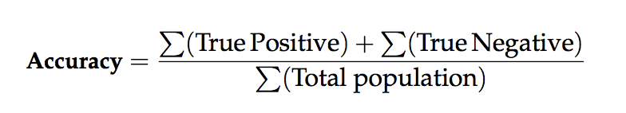
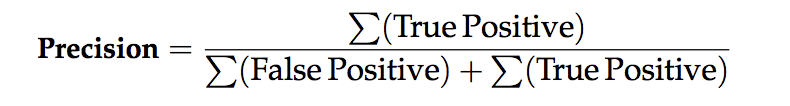
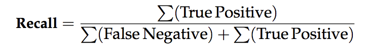
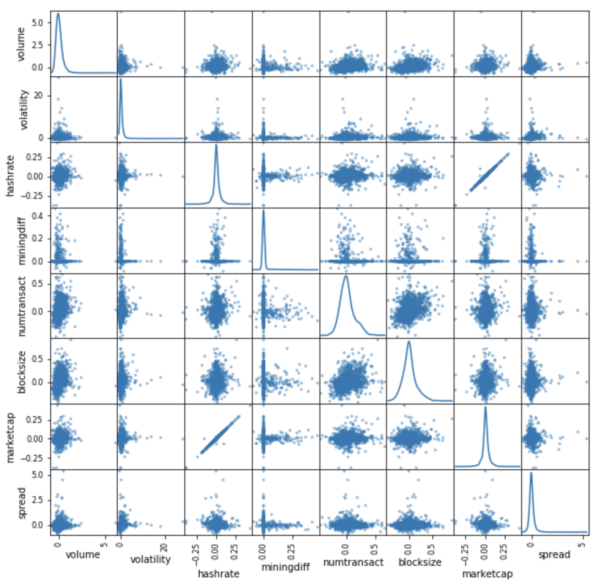
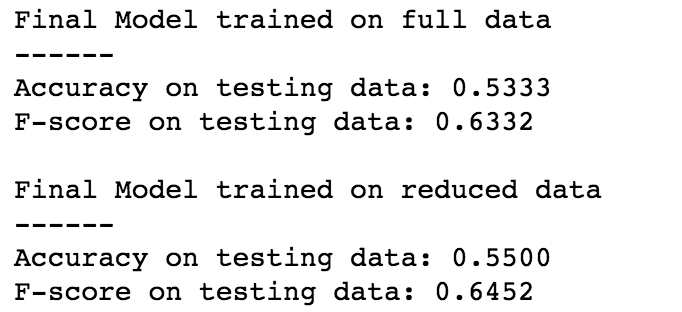

# Machine Learning Engineer Nanodegree
### Capstone Project
#### Predicting the Price of Bitcoin
Mark Black
<br>
December 17th, 2017
___

## I. Definition

### Project Overview
The field of finance is typically a stodgy tried and true industry where innovation is more evolutionary  than revolutionary. In the past few years the rapid rise in cryptocurrencies has ushered in a whole new digital financial ecosystem. Crytocurrencies have the potential to disrupt areas from payment processing to how we think about physical versus virtual assets. Bitcoin mania has swept the world as the price of the cryptocurrency continues to skyrocket. 

Finance professionals particularly those working on Wall Street have typically relied heavily on Excel spreadsheets, Econometrics and linear regression models for analysis. The rise of Machine Learning somewhat parallels the ascent of cryptocurriences as  businesses rapidly adopt and adjust to the era of "Big Data". This project explores the potential that Supervised Machine Learning holds in trying to predict the future price of Bitcoin.  

Even though it is still early innings there is already a ton of work being focused on trying to understand and predict the price of cryptoassets. Much of this project draws inspiration from the work Madan, ***et al***, where Supervised Machine Learning was used to forecast the price of Bitcoin but on shorter intraday time frames<sup>1</sup> 

This project deals with Bitcoin data on a daily time frame. Although it would have been nice and perhaps even more fruitful to use shorter time frame intervals unfortunately the availability of data for all variables played was the deciding factor. The datasets for all independent features can be found at [Blockchain.info](https://blockchain.info/) in the form of downloadable csv files. An alternative source to find the data is at [Quandl Blockchain](https://www.quandl.com/data/BCHAIN-Blockchain?keyword=).

### Problem Statement
Trying to predict the future price of any security or asset is central to Wall Street's ability to generate profitable trading and investment strategies. Bitcoin may have been originally intended to function as a digital payment processing system but participants have primarily been focused on it's speculative store of value. In the last year many crytocurrencies have risen more than tenfold in less than a year. Now with both the CBOE and CME introducing Bitcoin futures the motivation to forecast Bitcoin's daily price movements is a potentially lucrative endeavor<sup>2</sup>.

This project will employ a wide variety of Classification algorithms in order predict if Bitcon's price will the "up" or "down" each day in the test set. The data will be separated into sequential training and testing sets with each model being trained on the former and tested on the latter. 

From there the accuracy and f-scores for each individual model will be assessed along with it's performance as an automated trading system. Testing the profitability metrics of a trading system is known as alpha generation. The viability for any trading strategy is it's profiability above and beyond a buy and hold benchmark strategy (usually the annual return of the S&P500 index).

The following classifiers were selected:

- AdaBoost (Ensemble)
- Random Forest (Ensemble)
- Bagging (Ensemble)
- K-Nearest Neighbors (KNeighbors)
- Support Vector Machines (SVM)
- Logistic Regression

### Metrics
Once we have implemented a model, the most important question that arises is how good is the model? The most popular approach to evaluating a binary classification problems is by first starting to measure a model's accuracy, precision and f-score (also referred to as f-measure)<sup>3</sup>. These classification metrics accuracy and f-score provide context for how well each model did compared against a designated baseline. Once calculations are complete evaluation metrics are typically put into some sort of visual representation like a confusion matrix. For this project because multiple models will be assessed the accuracy and f-scores for each model will be combined into a single plot in order to rank model performance. The baseline for this project will be the Naive Bayes Predictor which will serve as the measure of performance of a very simple system. A more detailed description of each evaluation metric:

***F-beta Score***


***Precision, Recall, Accuracy***
<br>
<br>
**Accuracy** measures how often the classifier makes the correct prediction. It’s the ratio of the number of correct predictions to the total number of predictions (the number of test data points).
<br>
<br>


**Precision** tells us what proportion of forecasts we classified as up, actually were up.
It is a ratio of true positives(words classified as up, and which are actually up) to all positives(all words classified as up, irrespective of whether that was the correct classification), in other words it is the ratio of


<br>

**Recall(sensitivity)** tells us what proportion of forecasts that actually were up were classified by us as up.
It is a ratio of true positives(words classified as up, and which are actually up) to all the words that were actually up, in other words it is the ratio of


<br>

**Alpha**

While these metrics are insightful and can be a good indicator of a model's robustness it may be the case that a model with high accuracy may still not have strong predictive power commonly known as "The Accuracy Paradox". At the end of the day the name of the game in finance is to develop models or trading strategyies that are not only profitable but exceptionally profitable. 

The final metric that the models will be judged against is whether or not employing the algorithm in a trading model beats a simple "buy and hold" strategy. The net positive excess return of an active strategy above and beyond a certain index is known as "alpha". For this project the benchmark is just simply investing in Bitcoin from the start to the end of the testing period and the active trading strategies are the machine learning classifier models. The models will need to prove their superior profitability.   
___

## II. Analysis

### Data Exploration
As previously mentioned the source of the data for this project is blochain.info. The selection for the feature space is broken down below:

Input Feature | Continuous or Categorial | Description
--- | --- | ---
Trading Volume | Continuous | Total Daily volume in USD from all exchanges
Volaility | Continuous | Volatility is calculated as standard deviation from all market trades
Bid/Ask Spread | Continuous | Average daily spread between the Bid and Ask
Hashrate | Continuous | Average daily speed at which a computer is completing an operation in the Bitcoin code
Mining Difficulty | Continuous | How difficult it is to find a new block
Market Cap | Continuous | End of day total number of bitcoins times market value
Block Size | Continuous | Average block size (MB)
Number of Transactions | Continuous |  Total number of unique Bitcoin transactions per day

A dataframe of all the variables:


The start and end dates were selected primarily because the dataset was wholly intact for this period with no corrupt or missing data points like NAN's or Inf's. All the data seemed to be clean and as reliable for this particular exercise. The dates for the datasets are: 

```start='2013-01-01'```
<br>
```end='2017-12-01'```
<br>

And the the training and testing sets were broken up using an 80/20 split:
<br>
```Training set has 1436 samples.```
<br>
```Testing set has 360 samples.```

### Exploratory Visualization
Fortunately the datasets are intact meaning there are no missing or abnormal entries. However there are features that will need some sort of preprocessing adjustments.

Below is a plot of all the variables. Just from a cursory glance the variables have positive slopes wtih the exception of spread. From this an expectation of data preprocssing is going to be necessary. As a result histogram plots are generated in order to analyze the distribution characteristics of each indepedent variable. 


From the distribution plots of the raw values it is evident that most of the variables exhibit right or positive skewness<sup>4</sup>. Skewness signals that a feature or features contain values that lie near a single number but also a smaller subset of values that are lie or are distant from the single cluster. Algorithms can be sensitive to skewed distributions and can be adversely affected to underperform if the range is not properly normalized.


For the purposes of this model the independent variables will be converted to differential or the percent change from each day to the next. This will help normalize the variables. The methods and proesses for dealing with data transformations will be detailed in the "Data Proprocessing" stage. Preprocessing can help tremendously with the outcome and predictive power of nearly all learning algorithms.

### Algorithms and Techniques
Choosing the right model along with the right parameters is key to optimzing your performance metrics. 

Below is list of the classifiers selected for this particular project along with any parameter designations and a short description which includes each algorithm's respective primary strength and weakeness:

Classifier | Parameters | Description
--- | --- | ---
AdaBoost | random_state=0 | Ensemble learner where each iteration improves prediction by weighting misclassified labels. AdaBoost Ensemble algorithms are relatively fast but can be susceptible to noise and outliers. 
Random Forest | | Ensemble learner that uses a decision tree structures to arrive at a classification determination. Random Forest modles are typically fast to train but slow to make predictions and can be computationally expensive/slow.
Bagging | random_state=0 | Ensemble learner that involves taking multiple samples from your training dataset (with replacement) and training a model for each sample. The final output prediction is averaged across the predictions of all of the sub-models. 
K-Nearest Neighbors (KNeighbors) | | Uses k surrounding labels to classify. For continuous variables Euclidean distance. KNN algorithms are east to understand and implement but at the cost of being computationally expensive
Support Vector Machines (SVM) | random_state = 0 | Iterarive algorithm that creates separation gap(s) as wide as possible. A primary advantage of SVM's is their ability to create non-linear decision boundaries and capture complex relationships in datasets but computationally suffer with complexity and as datasets become too large
Logistic Regression | random_state = 0 |Special type of regression model that uses probability to determine a categorical response. Logistic Regression models tend to be fast for small dataset with limited features but have difficulty interpreting complex relationships within the data

### Benchmark
The first performance hurdle for the classifier algorithms is to beat a Naive Bayes Predictor benchmark. A Naive predictor<sup>5</sup> is simply used to show what a base model without any intelligence or "naive" would look like. Since there is no clear benchmark or research paper to compare against the results will be benchmarked with random choice. The below Naive Predictor was generated in the report:

```Naive Predictor: [Accuracy score: 0.5579, F-score: 0.6120]```

The second hurdle will be ranking the top 3 models in terms of their accuracy and f-scores and testing their "alpha<sup>6</sup> generation" potential against the passive "buy and hold strategy". This is a higher bar for any trading model to overcome as it must not only achieve a high level of accuracy in terms of predicting the daily direction of an asset but must also exhibit a high level of precision on the days where the returns were significant.

```The benchmark for Bitcoin is 12.917352```
___

## III. Methodology

### Data Preprocessing
Continuing from the Exploratory Visualization section the first preprocessing step will be to transform the raw values into differentials. This conversion involves taking the current day's value subtracting it from the previous day's value and dividing the difference by the previous day's value. In finance this percentage change is known as the "rate of return"<sup>7<sup>.
  

  
The distribution plots of the features post differential conversion are below:


When dealing with predicting future events it is necessary to "lag" the outcomes forward one day. This process is due to the fact that we are dealing with time and time series data sets where the features that are reported today are used to predict tomorrow's value. There is a whole branch of study for time series analysis which this project does not explore in-depth<sup>8</sup>. 

The second preprocessing step is dealing with collinearity. In order to identify variable pairs that exhibit a significant level of collinearity a the scatter matrix and table are generated below: 




From these two visual cues it is evident that the pair **hashrate** and **marketcap** are highly correlated at 0.992431. There are 3 options when dealing with highly correlated variables:

1. Reduce variables
2. Combine them into a single variable
3. Do nothing

For this project the decision to remove the **marketcap** was chosen as highly correlated variable may overstate the effects of a single variable.

The third data proessing step is to address skewed variables. From the distribution plots (post differentialization) the 2 skewed variables are **volume** and **spread**. In order to deal with skewed variables a logarithmic transformation is applied on the data so that the very large and very small values do not negatively affect the performance of a learning algorithm. Using a logarithmic transformation significantly reduces the range of values caused by outliers.


As the final processing step it is good practice to normalize all the numberic continuous features. This transformation process will level the playing field for the feature space in proper prepartion for the upcoming "Implementation" phase.

Because our features only consisted of numeric continuous values there is no need for dummy variable conversions like "one-hot encoding" scheme.

Further feature reduction  will be addressed later in the project.  

Now it is time to split the data into training and testing sets. Because the data is time series is not adviseable to randomly shuffle the data but rather maintain a sequential order of division. Using the 80/20 split the dates for the training set are ```2013-01-01``` to ```2016-12-06``` and the testing set dates are ```2016-12-07``` through ```2017-12-01```. 

### Implementation
Now that the data is all prepped and split into their respective sets and the learner models are all designated the implementation stage can commence.  Training, testing, predicting and acquiring the accuracy and fscores were all performed using the functions in the module ```preds.py```. Each classifier model is trained on the X_train independent features and y_train outcomes. Once each model is trained then the algorithms are each individually tested on the X_test independent feature dataset resulting in an array of binary predictions. 

Once the testing/prediction phase is complete each model's predictions are evaluated against the actual y_test outcomes. 2 hoirzontal dashed lines show the baseline Naive Bayes Predictor threshold. Evaluation consists of the accuracy and fscore and each model's performance is shown below:

<

It may appear that the Logistic Regression and SVM models performed best according to their accuracy and fscore but upon closer inspection this outperformance cannot be validated. The predictions for these 2 models were all "up" or 1's so we have to drop these two models as they were unable to differentiate outcomes. In fact these 2 models performance would mirror the baseline "buy and hold" strategy. For this reason the 2 algorithms must be disregarded.

Using the train_predict function a deeper analysis of the top 3 algorithms is initiated. In addition to accuracy and fscore the amount of computational time that each algorithm expended is displayed. Finally from the ```visuals.py``` module a plot of the top 3 performing classifiers is outlined:


It is no real surprise that each model failed to generate any excess "alpha" as indicative of the across the board low accuracy and fscores. In order to calculate the return streams for each model and the Bitcoin benchmark a "walk-forward" function was created in the ```walkf_forward.py``` module. The function first evaluates if the prediction for the model was correct, if correct sums the day's returns with the day's starting value and if incorrect subtracts the day's returns from the starting value. Then the function iterates this process storing each end day's value until the terminal value is reached. Below is a plot of this sequence of return streams for each valid model compared against the Bitcoin benchmark:

<

One coding challenge that arose with this particular project is trying to write modules for functions that are able to perform tasks that will be executed multiple times. Unfortunately scripting complex functions for plotting and implementing the models was tricky, time consuming and difficult to make work without generating embedded errors. In addition, Python 3 seems to have difficulty reloading a modified module<sup>9</sup>. None of the solutions proposed online worked and ultimately each time a module was changed and resaved the only way to recompile the altered module was to restart the kernel and run all the cells which became very time consuming. 

### Refinement
The winning algorithm is AdaBoost Ensemble. 

The premiere step in the refinement optimization proces is model tuning. GridSearchCV will be used to help tune our Adaboost model. GridSearchCV essentially optimizes the parameters of a classifier in scikit.

A number of variations of the following parameter ```parameters = {'n_estimators':[100,200,300],'learning_rate':[0.1,0.01,0.001]}``` were attempted resulting in the following best score:


Ironically the tuned model's prediction was once again all "1" or "Buy" signals for every day in the testing set. This confirms that the optimal approach for Bitcoin given for this project appears to be the "Buy and Hold" strategy. 

Now that the winning model has been found the process of feature optimization can begin. The first step in improving the algorithm is feature reduction. This process involves ranking all the features in an attempt to rank their importance. From this ranked set the top number of features are selected. Below is the rankings of the top 4 significant features:


The primary benefit with feature reduction is time cost savings in terms of computational efficiency at the expense of loss of performance. For this situation it appears that reducing the feature space down to only the 5 most relevant features not only increased time efficiency but also precipitates a slight increase in performance as well. Reducing the features any further (< 4) only leads the model predicting all "1" and thus reverting back to the default "Buy and Hold" strategy.

With less features required to train, the expectation is that training and prediction time is lower at the cost of performance metrics. From the visualization above, we see that the top five most important features contribute more than half of the importance of all features present in the data. This hints that we can attempt to reduce the feature space and simplify the information required for the model to learn. The code cell below will use the same optimized model you found earlier, and train it on the same training set with only the top five important features.



Finally the fruits of tuning and refining our model and training set are realized with a significantly improved performance from the AdaBoost Ensemble classifier model. While still underperforming the benchmark the model is now able to greatly enhance it's return stream:

```Final Alpha Performance of the Optimzed Feature Set AdaBoost Classifier is 11.790559```

<

___

## IV. Results

### Model Evaluation and Validation
AdaBoost Ensemble is a great classifier model because it is relatively fast, computationally efficient and has an intuitive iterative process that is more easily understood. The algorithm performed well by assigning more weight to the misclassifications in effort to learn from it's mistakes. Below are the parameter setting for AdaBoostClassifier from the sklearn.ensemble package:
```AdaBoostClassifier(algorithm='SAMME.R', base_estimator=None, learning_rate=1.0, n_estimators=50, random_state=0)```

Because of Bitcoin's inherent volatility during the time interval for this project small misclassifications in the outcomes can lead to significant under or over-performance of the model in terms of alpha. If this model were employed with a more seasoned and less historically volatile asset like US Treasuries the consequential results would not as greatly affect performance. 

Whenever money and real loss of money is involved it is necessary to thoroughly test a model before moving into a live production final stage. It is safe to assume that the results cannot be trusted and must be cross validated on more data and potential scenarios. This project is merely the first step in a long process but the promsing end results warrants further investigation. 

The robustness of the data and the model's predictions cannot wholly be trusted in forecasting future data. More testing, monitoring and developing will most likely need to follow.

### Justification
While the project fell short in overcoming the final hurdle of outperforming the "Buy and Hold" benchmark each model was able to achieve profitability. While it is a little deflating to spend so much time on to developing an underperforming model it is much worse to have built a model that loses money while simultaneously having the benchmark rise. In the past couple years the finance industry in it's race to employ data science and machine learning techniques has suffered from this very phenomenon<sup>10</sup.

Developing unfit or underperforming models is par for the course in finance as the competition is fierce and quantitative strategies are arbitraged away as more and more players exploit the same edge. Not only would a trading strategy need to beat it's benchmark but it would need to clearly exceed it as there are cost of doing business (trading fees/commissions, infrastructure costs, data fees, etc..) that will quickly eat away profibaility. 

This is simply the first step in the "alpha" discovery process. Some obvious areas of potential improvement this project could build on are:

- more data or shorter time intervals with a lot more data
- more unique exotic datasets relating to Bitcoin
- playing with different parameter settings
- continued tuning and feature reduction 

AdaBoost was able to outperform the Naive Bayes Predictor baseline accuracy and fscore which is a win and the final tuned and reduced featured model almost kept up with the Bitcoin benchmark. This result was a little surprising given such that our accuracy and fscores were around 60%. While this model is not a certified money machine it is very promising and has definitely laid a promising foundation to build on.
___

## V. Conclusion

### Free-Form Visualization


One inescapable question when analyzing the price of Bitcoin at the time of this project is: Is Bitcoin a bubble? And how can you identify an asset bubble? Is it irrational exuberance for an unproductive speculative asset to increase in value over 12 times in less than 2 years? In finance this kind of price action is truly extraordinary and the context for this anomalous behavior is evident from the chart below<sup>11</sup>. Compared with other historical bubbles it would appear that this is "the" bubble to rule them all. 

Why is this visual important to this project? The chart highlights the danger in using a model with this type of biased data to try to predict future outcomes. If classification models had been around during any of the other bubble mania events and were trained only on data preceding the fall, the models most likely would not have been able to adjust quickly enough to avoid catastrophic losses. 

In finance understanding regimes and cycles are critical to asset modeling and prediction. More of these topics will be discussed in the following sections.

<


### Reflection
While it is disheartening that the algorithms employed by this project failed to outperform the benchmark a simple "buy and hold" approach the project's real value lies in the process of deconstruction and research. This exercise is critical to understanding the underlying forces that govern Bitcoin's price movements. Because cryptocurrencies are so new and technical the research involved in trying to understand the features from hash rate to mining difficulty are worth the time and effort alone. It may very well be that the true promise in cryptocurrencies rest in an unknown unintended benefit that has yet to be fully revealed and this project has unearthed some interesting characteristics about the technology.

Some potential issues with this particular problem are that the data during the designated dates for Bitcoin only reflect a certain regime. Since Bitcoin's inception the price pattern trend has been only up meaning that there is an inherent positive bias to the data. This upward bias of the Bitcoin data makes it is difficult to beat the Bitcoin benchmark and as was seen during optimization improving the model tended to classify every day as a buy day. Another complication is should the crytocurrency space should enter a different regime the most obvious being a "firesale" downtrend any model trained on data before 2018 will most likely still produce upwardly skewed predictions.

Another drawback to this project is the restrictive limitation of daily data. Unfortunately intraday data on shorter intervals for the features listed was not available or was not freely available. It would interesting to see how these classifiers perform on larger datasets allowing for the models to learn more from increased training and testing.

At the end of the day the return results were positive and surpassed initial expectations. While very exciting and promising a more thorough stress test and vetting proess must follow in order to ensure that the algorithm is indeed legitimate. 

### Improvement
One area of improvement in this model is overlaying a numeric model like a regression model on top of the classification model in order to predict what the next day's potential return will be. The interplay between these 2 models may enhance the overall return as different portfolio weights may be instituted. For instance if the classifier predicts up and the regressor predicts a strong return value then the portfolio could max out capital and if there are conflicting signals use a smaller weight. 

Another area of improvement would be to analyze all the metrics that trading systems are measured with such as Sharpe Ratios, Win/Loss Rates, etc... Today clients and investors want to not only achieve a high level of return but also value the stability of those returns as well. A deeper dive into how the different models achieve their returns could redfine the designation of "best model".

In closing personally I am interested in deepening my understanding of Neural Networks so I have started investigating employing Deep Learning to a similar Bitoin project. In the very early stages of this project I started attempting using RNN Neural Networks from the Keras package but without the strong knowledge foundation the project was difficult to implement with limited time constraints. 

-----------

References:
<br>
<sup>1</sup>Madan, Saluja, Zhao"Automated Bitcoin Trading via Machine Learning Algorithms"
<br>
<sup>2</sup>[Precision and recall](https://en.wikipedia.org/wiki/Precision_and_recall)
<sup>3</sup>["Duelling bitcoin futures go head-to-head as CME launches contract"](https://www.ft.com/content/877b867c-e18e-11e7-8f9f-de1c2175f5ce)
<br>
<sup>4</sup>[Skewed Distribution: Definition, Examples](http://www.statisticshowto.com/probability-and-statistics/skewed-distribution/)
<br>
<sup>5</sup>[Naive Bayes Classifier](http://www.statsoft.com/textbook/naive-bayes-classifier)
<br>
<sup>6</sup>[Investopedia Definition of "Alpha"](https://www.investopedia.com/terms/a/alpha.asp)
<br>
<sup>7</sup>[Python 3 complication with reloading modules](https://stackoverflow.com/questions/8122734/pythons-imp-reload-function-is-not-working)
<br>
<sup>8</sup>[Rate of Return](https://en.wikipedia.org/wiki/Rate_of_return)
<br>
<sup>9</sup>[Introduction to Time Series Analysis](http://www.itl.nist.gov/div898/handbook/pmc/section4/pmc4.htm)
<br>
<sup>10</sup>[The Future Is Bumpy: High-Tech Hedge Fund Hits Limits of Robot Stock Picking](https://www.wsj.com/articles/the-future-is-bumpy-high-tech-hedge-fund-hits-limits-of-robot-stock-picking-1513007557)
<br>
<sup>11</sup>[It's Official: Bitcoin Surpasses "Tulip Mania", Is Now The Biggest Bubble In World History](http://www.zerohedge.com/news/2017-12-12/its-official-bitcoin-surpasses-tulip-mania-now-biggest-bubble-world-history)
